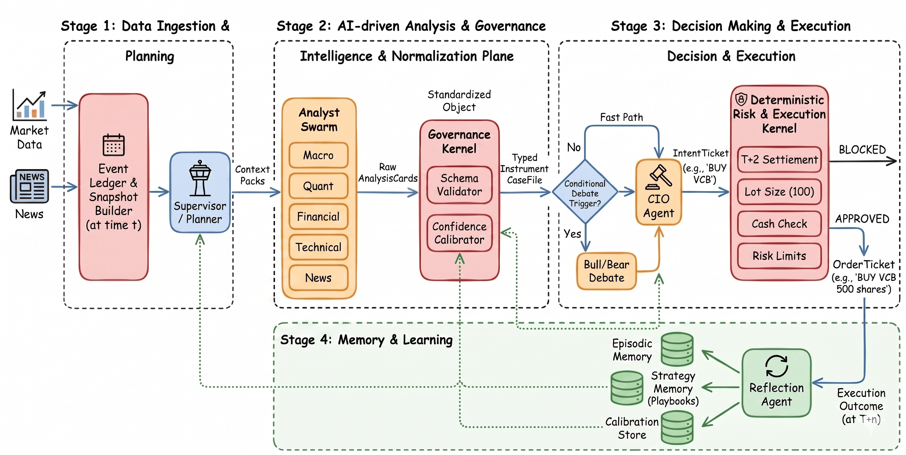
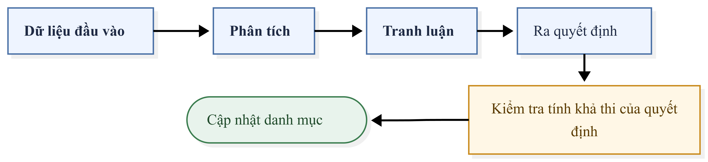
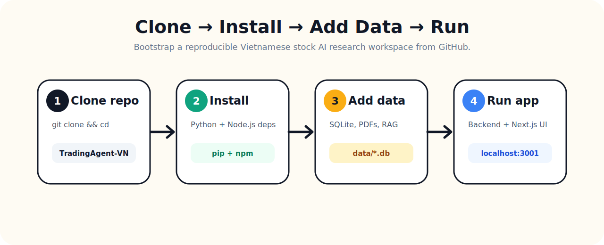
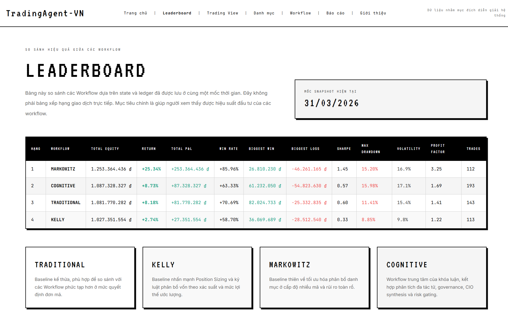

# TradingAgent-VN — AI Hedge Fund & Multi-Agent Stock Analyzer for Vietnam Market

<p align="center">
  
</p>

<p align="center">
  <a href="#-quick-start-clone--run"></a>
  <a href="#-financial-rag"></a>
  <a href="#-multi-agent-workflows"></a>
  <a href="#-dashboard--giao-diện"></a>
</p>

**TradingAgent-VN** là workspace nghiên cứu và demo **AI trading agent cho chứng khoán Việt Nam**: crawl dữ liệu thị trường, crawl tin tức, đọc báo cáo tài chính bằng **Financial RAG**, chạy nhiều agent chuyên gia song song và mô phỏng quyết định đầu tư qua.


---

## 🔎 Keywords / SEO

`Vietnam stock market AI`, `VNStock`, `VN30`, `AI Hedge Fund`, `multi-agent trading system`, `financial RAG`, `LightRAG`, `stock analyzer`, `Vietnamese stock analysis`, `backtest dashboard`, `quant trading`, `FastAPI`, `Next.js`, `SQLite`, `CafeF news crawler`, `financial report OCR`, `portfolio optimization`, `Kelly Criterion`, `Markowitz`, `Cognitive Trading`.

---

## 📚 Mục lục

- [Tính năng nổi bật](#-tính-năng-nổi-bật)
- [Kiến trúc hệ thống](#-kiến-trúc-hệ-thống)
- [Quick start: clone & run](#-quick-start-clone--run)
- [Setup dữ liệu](#-setup-dữ-liệu)
- [Cấu hình môi trường](#-cấu-hình-môi-trường)
- [CLI usage](#-cli-usage)
- [Financial RAG](#-financial-rag)
- [Multi-agent workflows](#-multi-agent-workflows)
- [Dashboard & giao diện](#-dashboard--giao-diện)
- [Cấu trúc thư mục](#-cấu-trúc-thư-mục)
- [Testing, linting](#-testing-linting)
- [Troubleshooting](#-troubleshooting)
- [Roadmap gợi ý](#-roadmap-gợi-ý)

---

## ✨ Tính năng nổi bật

| Nhóm | Mô tả |
|---|---|
| 📈 Market data | Crawl/sync OHLCV, benchmark VN30/VNINDEX và dữ liệu phục vụ backtest vào SQLite. |
| 📰 News intelligence | Crawl tin tài chính/chứng khoán Việt Nam, lưu vào `data/news.db`, hỗ trợ search/agent phân tích tin. |
| 📄 Financial RAG | Index file OCR báo cáo tài chính, truy vấn theo ticker/năm/quý bằng LightRAG và embedding model. |
| 🤖 Multi-agent analysis | 5 agent phân tích: Macro, Technical, Quant, News, Financial; CIO agent tổng hợp quyết định. |
| 🧠 Cognitive trading | Planner, analyst swarm, debate engine, governance/risk, memory và daily reporting. |
| 🧪 Backtesting | Traditional Scoring, Kelly Criterion, Markowitz Frontier và Cognitive Swarm. |
| 🖥️ UI realtime | FastAPI backend + Next.js frontend để chọn ticker/workflow và xem agent cards/report. |
| 📊 Research dashboard | Next.js dashboard trình bày leaderboard, portfolio playback, trading view và báo cáo backtest. |
| 🧾 Thesis/evaluation | Evaluation engine phục vụ data inventory, workflow metrics, diagnostics và LLM-as-judge. |

---

## 🧭 Kiến trúc hệ thống

<p align="center">
  
</p>

---

## ⚡ Quick start: clone & run

<p align="center">
  
</p>

### 0) Yêu cầu hệ thống

- **Python**: khuyến nghị Python `3.10` cho workspace chính. `tracking_news` có cấu hình riêng yêu cầu `>=3.11` nếu bạn chạy module đó độc lập.
- **Node.js**: Node `20+` khuyến nghị cho Next.js 16.
- **SQLite**: đi kèm Python/Conda; dashboard dùng `better-sqlite3`.
- **LLM endpoint/API key**: cần cho agent analysis, Financial RAG answer, CIO report. Nếu chỉ crawl dữ liệu hoặc xem dashboard artifact sẵn có thì có thể chưa cần.
- **GPU**: không bắt buộc. `requirements.txt` pin PyTorch CUDA 11.8; nếu máy không dùng CUDA, bạn có thể cài lại PyTorch CPU theo hướng dẫn chính thức của PyTorch.

### 1) Clone repo

```bash
git clone https://github.com/<your-username>/<your-repo>.git TradingAgent-VN
cd TradingAgent-VN
```

### 2) Cài Python dependencies

#### Cách A — Conda, khuyến nghị nếu dùng GPU/CUDA

```bash
conda env create -f environment.yml
conda activate vnstock-ai-hedgefund
```

#### Cách B — venv

**macOS/Linux**

```bash
python -m venv .venv
source .venv/bin/activate
python -m pip install --upgrade pip
pip install -r requirements.txt
pip install -r app/backend/requirements.txt
```

**Windows PowerShell**

```powershell
python -m venv .venv
.\.venv\Scripts\Activate.ps1
python -m pip install --upgrade pip
pip install -r requirements.txt
pip install -r app/backend/requirements.txt
```

> Nếu bị lỗi khi cài PyTorch CUDA trên máy không có CUDA, hãy cài bản CPU của PyTorch rồi chạy lại các package còn lại.

### 3) Cài frontend/dashboard dependencies

```bash
cd app/frontend
npm install
cd ../..

cd dashboard
npm install
cd ..
```

### 4) Tạo `.env`

Repo có template `.env.example`. Copy sang `.env` rồi điền API/proxy key của bạn.

**macOS/Linux**

```bash
cp .env.example .env
```

**Windows PowerShell**

```powershell
Copy-Item .env.example .env
```

Các biến tối thiểu thường cần sửa:

```env
CLIPROXY_BASE_URL=http://127.0.0.1:8317/v1
CLIPROXY_API_KEY=your-api-key-here
PRIMARY_MODEL=gpt-5.2
FINANCIAL_MODEL=gpt-5.2
NEWS_MODEL=gpt-5.2
DATA_DIR=data
VNSTOCK_DB_PATH=data/vnstock.db
NEWS_DB_PATH=data/news.db
BACKTEST_RESULTS_DIR=backtest_results
WORKDIR=vnstock/rag_storage
```

### 5) Set `PYTHONPATH` cho terminal hiện tại

`run.py` đã tự thêm một số path quan trọng, nhưng set `PYTHONPATH` giúp chạy module con ổn định hơn.

**macOS/Linux**

```bash
export PYTHONPATH="$PWD:$PWD/vnstock:$PWD/tracking_news:$PWD/cognitive_trading"
```

**Windows PowerShell**

```powershell
$env:PYTHONPATH = "$PWD;$PWD\vnstock;$PWD\tracking_news;$PWD\cognitive_trading"
```

### 6) Khởi tạo DB và crawl dữ liệu tối thiểu

```bash
python -c "from vnstock.database.models import init_db; init_db()"
python run.py crawl-vnstock --tickers FPT,VCB,HPG --replace-existing
python run.py crawl-news --news-days 2 --source cafef
```

> Lưu ý: subcommand đúng là `crawl-vnstock` và `crawl-news` bằng dấu gạch ngang.

### 7) Chạy app realtime

Terminal 1 — backend FastAPI:

```bash
python app/start_backend.py
```

Terminal 2 — frontend Next.js:

```bash
cd app/frontend
npm run dev
```

Mở: <http://localhost:3001>

---

## 🧩 Setup dữ liệu


### Dữ liệu tối thiểu

| Dữ liệu | Đường dẫn mặc định | Bắt buộc? | Cách tạo / thêm |
|---|---|---:|---|
| Market OHLCV | `data/vnstock.db` | ✅ | `python run.py crawl-vnstock --tickers FPT,VCB --replace-existing` |
| News DB | `data/news.db` | Khuyến nghị | `python run.py crawl-news --news-days 2 --source cafef` |
| App runtime | `app/data/` | Tự tạo | Backend lưu portfolio/history/cache khi chạy app. |
| Financial OCR text | `vnstock/libs/data/financial_reports/*.ocr_text.txt` | Cần cho RAG | Thêm file OCR theo mẫu `FPT-Q4-2025.ocr_text.txt`. |
| Financial PDF | `vnstock/libs/data/financial_reports/*.pdf` | Tuỳ chọn | Lưu báo cáo gốc để trace nguồn. |
| RAG storage | `vnstock/rag_storage/<TICKER>/<YEAR>/<QUARTER>/` | Tạo sau index | `python run.py rag index --input vnstock/libs/data/financial_reports` |
| Backtest artifacts | `backtest_results/` | Cần cho dashboard backtest | Chạy `python run.py backtest ...` hoặc copy artifact sẵn có. |
| Cognitive DB | `data/cognitive.db` | Tuỳ chọn | Sinh khi chạy cognitive trading/memory. |

### Cách thêm financial reports cho RAG

Đặt file vào:

```text
vnstock/libs/data/financial_reports/
├── FPT-Q4-2025.pdf
├── FPT-Q4-2025.ocr_text.txt
├── VCB-Q4-2025.pdf
└── VCB-Q4-2025.ocr_text.txt
```

Sau đó index:

```bash
python run.py rag index --input vnstock/libs/data/financial_reports
```

Query thử:

```bash
python run.py rag query \
  --query "Biên lợi nhuận và rủi ro chính của FPT trong Q4 2025 là gì?" \
  --ticker FPT \
  --year 2025 \
  --quarter Q4 \
  --mode hybrid
```

### Cách tạo dữ liệu backtest cho dashboard

```bash
python run.py backtest \
  --tickers FPT,HPG,SSI,GAS,VCB \
  --start 2026-03-24 \
  --end 2026-03-25 \
  --workflows Traditional,Kelly,Markowitz
```

Cognitive pipeline:

```bash
python run.py backtest-cognitive --tickers VN30 --start 2026-01-05 --end 2026-01-26
```

Output nằm trong `backtest_results/` và được dashboard đọc trực tiếp.

### Gợi ý khi publish GitHub

Nếu dữ liệu quá lớn, không nên commit trực tiếp toàn bộ DB/PDF/artifact vào Git. Thay vào đó:

1. Commit code, `.env.example`, README và một sample nhỏ.
2. Upload DB/artifact lớn lên GitHub Releases, Google Drive, Hugging Face Dataset hoặc S3.
3. Trong README, thêm link tải dữ liệu và hướng dẫn giải nén vào đúng path:

```text
TradingAgent-VN/
├── data/
│   ├── vnstock.db
│   ├── news.db
│   └── cognitive.db
├── vnstock/rag_storage/
└── backtest_results/
```

---

## ⚙️ Cấu hình môi trường

`config.py` đọc `.env` ở root và cung cấp các nhóm config chính:

| Nhóm | Biến tiêu biểu |
|---|---|
| LLM/proxy | `CLIPROXY_BASE_URL`, `CLIPROXY_API_KEY`, `PRIMARY_MODEL`, `T2_*`, `T3_*`, `T4_CIO`, `DAILY_REPORT` |
| Data paths | `DATA_DIR`, `VNSTOCK_DB_PATH`, `NEWS_DB_PATH`, `COGNITIVE_DB_PATH`, `BACKTEST_RESULTS_DIR`, `WORKDIR` |
| Trading defaults | `PORTFOLIO_CASH`, `LOT_SIZE`, `BUY_FEE_RATE`, `SELL_FEE_RATE`, `MAX_TRADE_PCT` |
| Strategy thresholds | `PRICE_CHANGE_THRESHOLD`, `VOL_RATIO_THRESHOLD`, `NEWS_MIN_COUNT`, `ALPHA_THRESHOLD` |
| Risk limits | `MAX_POSITION_PCT`, `MAX_DRAWDOWN_PCT`, `STOP_LOSS_PCT`, `MIN_CASH_RESERVE_PCT` |
| RAG | `EMBEDDING_MODEL_NAME`, `CHUNK_SIZE`, `CHUNK_OVERLAP`, `RAG_QUERY_TIMEOUT_SECONDS` |
| Backend | `BACKEND_HOST`, `BACKEND_PORT`, `BACKEND_RELOAD` |

> Không commit secret thật. Hãy dùng `.env.example` cho template public và giữ `.env` local/private.

---

## 🧰 CLI usage

Entrypoint chính: `run.py`.

```bash
python run.py --help
```

### Crawl giá cổ phiếu

```bash
# Crawl watchlist mặc định
python run.py crawl-vnstock

# Crawl ticker cụ thể
python run.py crawl-vnstock --tickers FPT,VCB,HPG

# Crawl full history và thay thế dữ liệu cũ
python run.py crawl-vnstock --tickers VN30 --replace-existing

# Giảm tốc request nếu upstream rate limit
python run.py crawl-vnstock --tickers FPT,VCB --max-requests-per-minute 10
```

### Crawl tin tức

```bash
python run.py crawl-news --news-days 2 --source cafef
```

### Sync một lần: giá + tin + fundamental report cache

```bash
python run.py sync --tickers FPT,VCB --year 2025 --quarter Q4 --news-days 3

# Alias tương đương
python run.py prepare --tickers FPT,VCB --year 2025 --quarter Q4 --news-days 3
```

### Sinh báo cáo phân tích tài chính

```bash
python run.py analyze --ticker FPT --year 2025 --quarter Q1
```

Output:

```text
vnstock/analysis_reports/<TICKER>_<YEAR>_Q<n>.md
```

Nếu report đã tồn tại, hệ thống có thể dùng cache; xoá file output nếu muốn regenerate.

### Backtest legacy workflows

```bash
python run.py backtest \
  --tickers FPT,HPG,SSI,GAS,VCB \
  --start 2026-03-24 \
  --end 2026-03-25 \
  --workflows Traditional,Kelly,Markowitz
```

### Backtest cognitive workflow

```bash
python run.py backtest-cognitive --tickers VN30 --start 2026-01-05 --end 2026-01-26
```

Hoặc chạy module trực tiếp:

```bash
python -m cognitive_trading.runner --tickers FPT,VCB --start 2026-01-05 --end 2026-01-26
```

---

## 📄 Financial RAG

Financial RAG dùng OCR text/PDF báo cáo tài chính để trả lời câu hỏi theo ticker/năm/quý.

### Index

```bash
python run.py rag index --input vnstock/libs/data/financial_reports
```

Mặc định chỉ index file khớp pattern:

```text
*.ocr_text.txt
```

Có thể đổi pattern:

```bash
python run.py rag index --input vnstock/libs/data/financial_reports --pattern "*.txt"
```

### Query

```bash
python run.py rag query \
  --query "Rủi ro nợ xấu của VCB trong Q4 2025 là gì?" \
  --ticker VCB \
  --year 2025 \
  --quarter Q4 \
  --mode hybrid
```

Mode hỗ trợ:

- `global`: ưu tiên bối cảnh tổng thể.
- `local`: ưu tiên entity/chunk gần câu hỏi.
- `hybrid`: kết hợp cả hai, khuyến nghị cho phần lớn câu hỏi.

### RAG dashboard

```bash
python run.py rag dashboard --port 8501
```

Mở: <http://localhost:8501>

---

## 🤖 Multi-agent workflows

<p align="center">
  
</p>

### Agent chuyên gia

| Agent | Vai trò |
|---|---|
| Macro Agent | Đọc bối cảnh vĩ mô, thị trường, benchmark và sentiment tổng quát. |
| Technical Agent | Phân tích giá, xu hướng, momentum, volume và tín hiệu kỹ thuật. |
| Quant Agent | Chạy mô hình định lượng, risk/return, xác suất và tín hiệu thống kê. |
| News Agent | Tổng hợp tin mới, sự kiện doanh nghiệp và sentiment từ `data/news.db`. |
| Financial Agent | Dùng RAG báo cáo tài chính để phân tích fundamentals. |
| CIO Agent | Tổng hợp tín hiệu, kiểm tra rủi ro và tạo khuyến nghị/báo cáo cuối. |

### Workflow đầu tư/mô phỏng

| Workflow | Mục tiêu |
|---|---|
| Traditional Scoring | Chấm điểm tín hiệu theo luật/trọng số truyền thống. |
| Kelly Criterion | Tối ưu sizing dựa trên xác suất thắng/thua và payoff. |
| Markowitz Frontier | Tối ưu danh mục theo mean-variance/efficient frontier. |
| Cognitive Swarm | Planner + analyst swarm + debate + governance + memory. |

---

## 🖥️ Dashboard & giao diện

### 1) App realtime: `app/`

Backend:

```bash
python app/start_backend.py
```

Frontend:

```bash
cd app/frontend
npm run dev
```

URL: <http://localhost:3001>

Trang chính:

- Chọn ticker: `FPT`, `HPG`, `VCB`, `SSI`, `GAS`.
- Chọn workflow: Traditional, Kelly, Markowitz, Cognitive.
- Bấm **Phân tích**.
- Xem agent cards hoàn thành dần, CIO summary và Markdown report.

Các trang phụ:

- `/portfolio`: quản lý cash/position, refresh giá, NAV/P&L.
- `/history`: xem lại các analysis đã lưu.

API backend tiêu biểu:

```bash
curl http://localhost:8000/api/health
curl "http://localhost:8000/api/market/prices?tickers=FPT,VCB"
curl http://localhost:8000/api/portfolio/value
```

### 2) Dashboard backtest: `dashboard/`

```bash
cd dashboard
npm run dev
```

Mặc định script chạy ở port `8000`:

```text
http://localhost:8000
```

Dashboard đọc trực tiếp:

- `backtest_results/`
- `data/vnstock.db`

Các màn hình chính:

- Overview/KPI.
- Workflow/Agents.
- Leaderboard.
- Portfolio playback.
- Trading view/candlestick.
- Blog/report outputs.
- About/thesis explanation.

> ⚠️ Nếu bạn đang chạy FastAPI backend ở port `8000`, dashboard sẽ bị conflict port. Có thể chạy dashboard ở port khác:

```bash
cd dashboard
npx next dev -H 0.0.0.0 -p 3000
```

Sau đó mở <http://localhost:3000>.

### 3) Financial MCP server, optional

```bash
python -m vnstock.servers.financial_server
```

Tools chính:

- `get_macro_news`
- `get_stock_news`
- `get_technical_report`
- `get_price_history`
- `run_quant_prediction`
- `analyze_financial_report`

---

## 🗂️ Cấu trúc thư mục

```text
TradingAgent-VN/
├── app/                         # FastAPI backend + Next.js realtime frontend
│   ├── backend/                  # API routers/services: analysis, market, portfolio, history
│   ├── frontend/                 # Next.js UI ở port 3001
│   └── data/                     # Portfolio/history/cache runtime
├── vnstock/                      # Core agents, workflows, DB, RAG, MCP server
│   ├── agents/                   # financial, macro, news, technical, quant agents
│   ├── database/                 # SQLite schema/repository
│   ├── jobs/                     # Market crawler
│   ├── libs/rag_engine/          # LightRAG ingest/query/dashboard
│   ├── servers/                  # MCP financial server
│   └── tools/backtest/           # Backtest engine/portfolio/risk metrics
├── cognitive_trading/            # Planner, swarm, debate, governance, memory, reporting
├── tracking_news/                # Vietnamese news crawler, MCP server, Streamlit dashboard
├── evaluation_engine/            # Metrics, diagnostics, judge dataset/report
├── dashboard/                    # Next.js research/backtest dashboard
├── data/                         # vnstock.db, news.db, cognitive.db
├── backtest_results/             # Backtest ledgers, states, normalized artifacts, reports
├── thesis/                       # Thesis/Overleaf materials
├── docs/assets/                  # README images and diagrams
├── config.py                     # Central config loaded from .env
├── run.py                        # Root CLI entrypoint
├── environment.yml               # Conda environment
├── requirements.txt              # Python dependencies
└── .env.example                  # Public env template
```

---

## 🧪 Testing, linting

### Python

Hiện workspace chính chưa có test suite root chuẩn hóa. Một số module có test/helper riêng.

Tracking news có cấu hình pytest trong `tracking_news/pyproject.toml`:

```bash
cd tracking_news
pytest
```

### Frontend realtime

```bash
cd app/frontend
npm run lint
npm run build
```

### Dashboard

```bash
cd dashboard
npm run lint
npm run build
```

> Một số test `.cjs` trong dashboard có thể cần chỉnh path local nếu bạn chạy trên máy khác.

---

## 🛠️ Troubleshooting

### `ImportError` khi chạy module Python

Set `PYTHONPATH`:

```bash
export PYTHONPATH="$PWD:$PWD/vnstock:$PWD/tracking_news:$PWD/cognitive_trading"
```

Windows PowerShell:

```powershell
$env:PYTHONPATH = "$PWD;$PWD\vnstock;$PWD\tracking_news;$PWD\cognitive_trading"
```

### Thiếu database

Khởi tạo schema:

```bash
python -c "from vnstock.database.models import init_db; init_db()"
```

Sau đó crawl dữ liệu:

```bash
python run.py crawl-vnstock --tickers FPT,VCB --replace-existing
python run.py crawl-news --news-days 2 --source cafef
```

### Dashboard không có dữ liệu

Dashboard backtest cần `backtest_results/` và `data/vnstock.db`. Hãy chạy backtest trước:

```bash
python run.py backtest --tickers FPT,VCB --start 2026-03-24 --end 2026-03-25 --workflows Traditional,Kelly,Markowitz
```

### Port `8000` bị chiếm

- FastAPI backend mặc định dùng `8000`.
- Dashboard package cũng mặc định dùng `8000`.

Giải pháp:

```bash
cd dashboard
npx next dev -H 0.0.0.0 -p 3000
```

### RAG query không có context

Kiểm tra:

1. File OCR có đúng đuôi `*.ocr_text.txt` không.
2. Tên file nên có ticker/quý/năm như `FPT-Q4-2025.ocr_text.txt`.
3. Đã chạy index chưa:

```bash
python run.py rag index --input vnstock/libs/data/financial_reports
```

### Agent/CIO không trả lời

Kiểm tra `.env`:

```env
CLIPROXY_BASE_URL=...
CLIPROXY_API_KEY=...
PRIMARY_MODEL=...
T2_MACRO=...
T4_CIO=...
```

Nếu endpoint LLM của bạn không tương thích OpenAI-style API, cần sửa adapter trong phần LLM core.

### Lỗi cài PyTorch CUDA

`requirements.txt` pin CUDA 11.8. Nếu máy không có CUDA/GPU phù hợp, hãy cài bản CPU theo hướng dẫn PyTorch, sau đó cài các dependency còn lại.

### Không commit API key

Nếu có script hoặc file local chứa key thật, hãy chuyển sang `.env` trước khi public GitHub. Không push `.env`, token, database private hoặc dữ liệu có bản quyền nếu bạn không có quyền phân phối.

---

## 🧱 Stack công nghệ

| Layer | Tech |
|---|---|
| Language | Python, TypeScript |
| Backend | FastAPI, Uvicorn, Pydantic |
| Frontend | Next.js 16, React 19, Tailwind CSS 4 |
| Data | SQLite, SQLAlchemy, pandas, numpy |
| Finance | vnstock3, yfinance, cvxpy, scipy, scikit-learn, pandas-ta |
| AI/LLM | OpenAI-compatible API, pyautogen, transformers, sentence-transformers |
| RAG | LightRAG, FAISS CPU, BAAI/bge-m3 embedding |
| Dashboard | Next.js, lightweight-charts, mermaid, react-markdown |
| Visualization | Streamlit, Plotly |

---

## 🗺️ Roadmap gợi ý

- [ ] Thêm script `make setup` hoặc `taskfile` để tự động hóa install.
- [ ] Thêm sample dataset nhỏ để người clone chạy demo ngay trong vài phút.
- [ ] Chuẩn hóa `.gitignore` cho `.env`, DB lớn, cache và artifact.
- [ ] Đưa dữ liệu lớn lên GitHub Releases/Hugging Face Dataset và thêm script download.
- [ ] Thêm screenshot thật từ app sau khi deploy local.
- [ ] Chuẩn hóa pytest cho root workspace.
- [ ] Thêm Docker Compose cho backend/frontend/dashboard.
- [ ] Thêm GitHub Actions: lint, build frontend, smoke test CLI.


---

## ⭐ Nếu dự án hữu ích

Nếu bạn thấy repo này hữu ích cho nghiên cứu AI agent, phân tích chứng khoán Việt Nam hoặc Financial RAG, hãy **star repo** để ủng hộ dự án.
